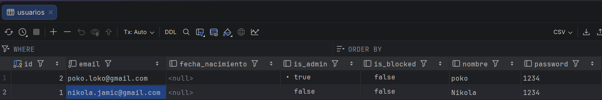
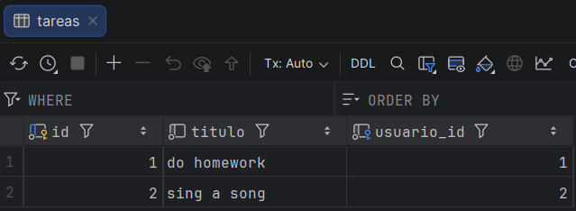
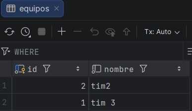
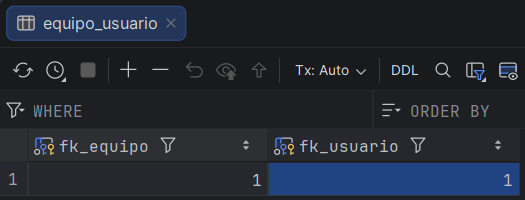

# README_TDD - User Stories 009 and 010

## 1) Scope and objective

This document summarizes the implementation done for user stories **009 (mandatory)** and **010 (optional)** using a test-driven workflow, including service layer behavior, web layer endpoints, Thymeleaf views, and automated tests.

- **Story 009**: team membership management (create teams, join/leave teams, add/remove members), with correct many-to-many bidirectional updates between `Usuario` and `Equipo`.
- **Story 010**: administrator team management (rename and delete teams), with controller-level authorization checks and admin-only controls in the UI.

The goal was to keep incremental changes small, preserve existing behavior, and validate each feature with tests.

---

## 2) PostgreSQL development database screenshot






---

## 3) Endpoints and implementation by story

### 3.1 Story 009 - Manage team membership

#### Endpoints

```text
GET    /equipos
GET    /equipos/{id}
GET    /equipos/nuevo
POST   /equipos/nuevo
POST   /equipos/{id}/join
POST   /equipos/{id}/leave
POST   /equipos/{id}/leaveFromList
POST   /equipos/{id}/leaveFromDescription
POST   /equipos/{id}/addUser
POST   /equipos/{id}/removeUser
```

#### Classes and methods

Main web orchestration is in:

- `src/main/java/todolist/controller/EquipoController.java`
  - `listadoEquipos(Model)`
  - `descripcionEquipo(Long, Model)`
  - `crearEquipo(String, RedirectAttributes)`
  - `joinTeam(Long, RedirectAttributes)`
  - `leaveTeam(Long, RedirectAttributes)`
  - `leaveTeamFromList(Long, RedirectAttributes)`
  - `leaveTeamFromDescription(Long, RedirectAttributes)`
  - `addUserToTeam(Long, String, RedirectAttributes)`
  - `removeUserFromTeam(Long, Long, RedirectAttributes)`

Business rules are implemented in:

- `src/main/java/todolist/service/EquipoService.java`
  - `crearEquipo(String)` validates non-empty names and prevents duplicates.
  - `anadirUsuarioAEquipo(Long, Long)` validates team/user existence and prevents duplicates.
  - `quitarUsuarioDeEquipo(Long, Long)` removes membership safely.
  - `findAllOrdenadoPorNombre()` returns ordered team data.
  - `usuariosEquipo(Long)` and `equiposUsuario(long)` provide membership queries.

#### Thymeleaf templates

- `src/main/resources/templates/listaEquipos.html`
  - Displays all teams in alphabetical order.
  - Team names are clickable links to `/equipos/{id}`.
  - Shows conditional `Join` or `Leave` buttons depending on logged user membership.
- `src/main/resources/templates/descripcionEquipo.html`
  - Displays team title and members list.
  - Provides add-member form (email), remove-member action, and membership actions.
- `src/main/resources/templates/formNuevoEquipo.html`
  - Team creation form.
- `src/main/resources/templates/fragments.html`
  - Navbar includes `Teams` option.

#### Tests

- `src/test/java/todolist/service/EquipoServiceTest.java`
  - Team creation validations, alphabetical ordering, membership add/remove, exception cases, and bidirectional consistency checks.
- `src/test/java/todolist/controller/EquipoWebTest.java`
  - Listing/detail rendering, join/leave behavior, create/add/remove flows, and unauthorized access scenarios.

---

### 3.2 Story 010 - Team management (administrator)

#### Endpoints

```text
POST   /equipos/{id}/renombrar
POST   /equipos/{id}/eliminar
```

#### Classes and methods

- `src/main/java/todolist/service/EquipoService.java`
  - `renombrarEquipo(Long, String)`:
    - validates target team existence,
    - validates non-empty new name,
    - validates uniqueness to avoid duplicate team names,
    - persists the updated entity.
  - `eliminarEquipo(Long)`:
    - validates existence,
    - removes all user-team relations,
    - deletes the team.

- `src/main/java/todolist/controller/EquipoController.java`
  - `renombrarEquipo(Long, String, RedirectAttributes)`:
    - checks logged user,
    - checks admin permissions with `usuarioService.esAdministrador(...)`,
    - delegates to service and uses flash messages.
  - `eliminarEquipo(Long, RedirectAttributes)`:
    - same authorization pattern,
    - delegates to service delete operation and redirects.
  - `descripcionEquipo(...)` now includes `usuarioEsAdmin` in model to render admin-only controls.

#### Thymeleaf templates

- `src/main/resources/templates/descripcionEquipo.html`
  - Admin-only rename form (new name input + submit).
  - Admin-only delete button.
  - Controls are shown only when `usuarioEsAdmin` is true.

#### Tests

- `src/test/java/todolist/service/EquipoServiceTest.java`
  - `renombrarEquipo` and `eliminarEquipo` service behavior.
- `src/test/java/todolist/controller/EquipoWebTest.java`
  - Admin rename endpoint redirection test.
  - Admin delete endpoint redirection test.
  - Admin controls visible for admin and hidden for non-admin in team description page.

---

## 4) Interesting source code excerpts

### 4.1 Bidirectional many-to-many cleanup on remove

To avoid inconsistent associations, remove operations update both sides of the relation via helper methods in the domain model.

```java
@Transactional
public void quitarUsuarioDeEquipo(Long idEquipo, Long idUsuario) {
    Equipo equipo = equipoRepository.findById(idEquipo).orElse(null);
    if (equipo == null) throw new EquipoServiceException("El equipo no existe");

    Usuario usuario = usuarioRepository.findById(idUsuario).orElse(null);
    if (usuario == null) throw new EquipoServiceException("El usuario no existe");

    if (!equipo.getUsuarios().contains(usuario))
        throw new EquipoServiceException("El usuario no pertenece al equipo");

    equipo.removeUsuario(usuario);
    equipoRepository.save(equipo);
    usuarioRepository.save(usuario);
}
```

This pattern is reused during team deletion: each user relation is detached before deleting the team entity.

### 4.2 Controller-level admin authorization

Admin actions are guarded in controller methods before invoking service logic.

```text
if (!usuarioService.esAdministrador(idUsuarioLogeado)) {
    flash.addFlashAttribute("error", "Permisos insuficientes");
    return "redirect:/equipos";
}
```

This ensures only administrators can perform rename/delete actions from the web layer.

---

## 5) Test and quality summary

The implementation follows incremental cycles with tests validating service and web behavior. Current test coverage includes:

- normal behavior (create, list, join, leave, rename, delete),
- edge cases and errors (non-existing team/user, duplicated names, duplicated membership, empty name),
- authorization checks (not logged user and admin-only controls).

The final integrated run reports all tests passing in the project test suite.

---

